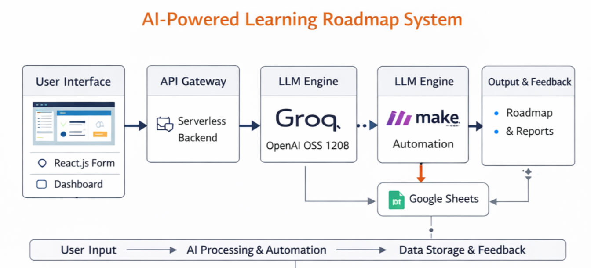

---

#  AI-Powered Adaptive Learning Roadmap Generator

> **An intelligent learning assistant that interviews users, assesses skill levels, generates adaptive study roadmaps, and tracks progress using LLM + automation agents.**

---
## 🧩 Problem Statement

> Build an intelligent agent-based learning system that interviews users, assesses skill levels, generates personalized weekly roadmaps, dynamically adapts to feedback, and continuously tracks learning progress.

---

## 📌 Overview

Traditional learning platforms provide **static content and generic learning paths**, which often fail to adapt to individual learner needs, pace, and goals.

This project introduces an **AI-powered adaptive learning system** that:

* Understands the learner’s **goal, competency level, and time constraints**
* Conducts an **AI-based diagnostic assessment**
* Generates a **personalized, structured learning roadmap**
* Continuously **tracks progress and adapts plans**
* Automates **resource discovery and workflow orchestration** using intelligent agents

The system leverages **Large Language Models (LLMs)** and **workflow automation agents (n8n)** to create a **dynamic, student-centric learning experience**.

---

## 🎯 Target Users

* School Students
* College Students
* Competitive Exam Aspirants

---

##  Key Features

### ✅ Implemented Features

* **Smart Onboarding Form (React.js UI)**

  * Captures learning goal, current skill level, and time availability.

* **AI-Based Diagnostic Test Generation**

  * Automatically generates **10 adaptive questions** (easy, medium, hard).
  * Evaluates competency and identifies **knowledge gaps**.

* **Automated Competency Evaluation**

  * Calculates scores.
  * Highlights strengths and improvement areas.

* **Personalized Structured Learning Roadmap**

  * Generates **weekly/day-wise learning plans**.
  * Adapts difficulty based on user competency.

* **Progress Tracking using Automation Agent**

  * Stores **learning progress in Google Sheets**.
  * Maintains long-term learning history.

---

### Future Enhancements

*  Automated **email reminders & deadline alerts**
* **Dynamic roadmap adaptation** based on continuous feedback
*  Visual analytics dashboard
*  Concept-level weakness detection & revision planning

---

## 🏗️ System Architecture

 **WorkFlow Diagram** 

---

## ⚙️ Tech Stack

| Layer               | Technology             |
| ------------------- | ---------------------- |
| Frontend            | React.js               |
| Backend             | Serverless APIs        |
| AI Model            | Groq – OpenAI OSS 120B |
| Agent Orchestration | n8n                    |
| Database            | Google Sheets          |
| Deployment          | Local                  |

---

## 🔁 Workflow Pipeline

1. User submits learning preferences via React UI.
2. Backend forwards request to **n8n automation workflow**.
3. n8n sends structured prompts to **Groq LLM**.
4. LLM:

   * Generates diagnostic test
   * Evaluates responses
   * Builds structured learning roadmap
5. n8n stores progress data into **Google Sheets**.
6. Roadmap and evaluation are displayed on the user dashboard.

---

## 🌟 Innovation & Uniqueness

* **Adaptive learning intelligence instead of static courses**
* **Agent-based orchestration using n8n**
* **Dynamic competency evaluation using LLM reasoning**
* **Fully automated progress tracking**
* **Scalable design for future adaptive coaching**

---

## 👥 Team Members

| Name                  | Role                                  |
| --------------------- | ------------------------------------- |
| **Shivam Chopade**    | System Architecture & AI Integration  |
| **Pratik Patil**      | Frontend Development                  |
| **Kushagra Prajapat** | Automation & n8n Workflow Engineering |

---

## Example Use Case

> A student preparing for **DSA interviews in 2 months** enters their goal and current level.
> The system:
>
> * Generates a diagnostic test
> * Identifies weak concepts
> * Creates a structured weekly roadmap
> * Tracks learning progress automatically
> * (Future) Sends reminders & adapts learning plan

---

## 🏁 Conclusion

This project demonstrates the **practical integration of AI + automation agents** to build a **truly adaptive learning platform**, addressing real-world challenges in personalized education.

---

